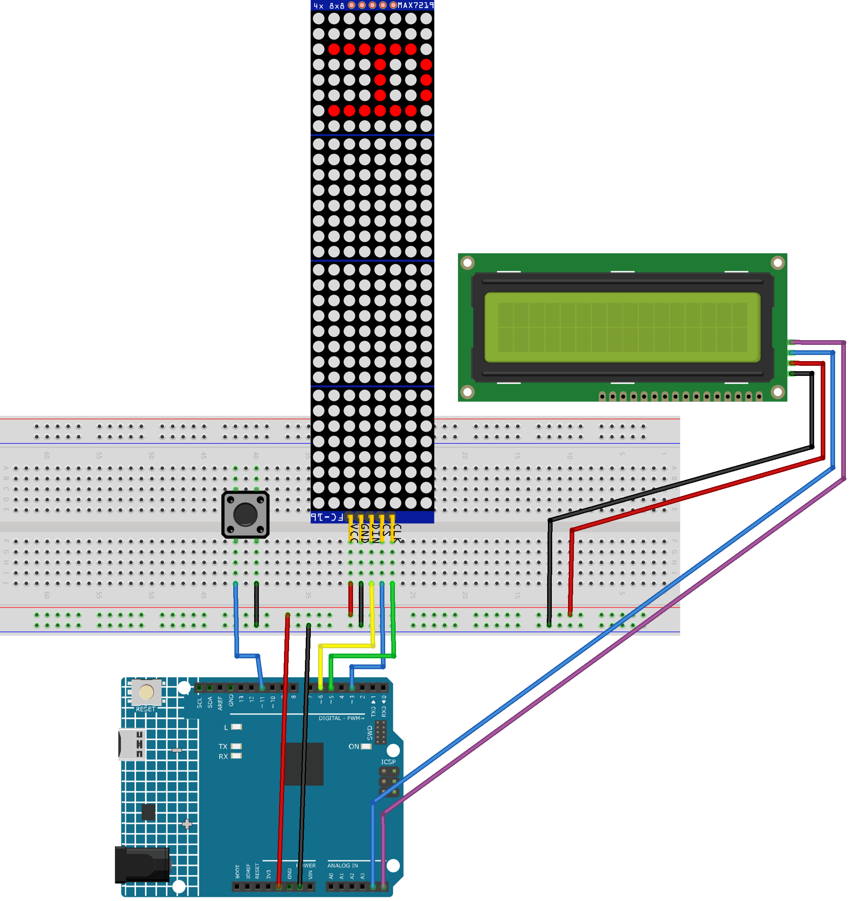

# 🕹️ BlockoHolics-source

A "Block Blast" (Stacker-style) game for Arduino using LED matrices and an LCD.

## 🚀 Features
- **🧱 Dynamic Gameplay**: Stack blocks across 32 columns (4 LED matrices).
- **📈 Difficulty Scaling**: The game speed increases as you progress (layers 4, 8, and 12).
- **📟 Status Display**: 16x2 LCD shows current block width and total layers placed.
- **🖱️ Easy Controls**: Single-button interaction for gameplay and restart.

## 🛠️ Hardware Requirements
- **🤖 Arduino Board**: Uno, Nano, or Mega.
- **📺 Display**: 4x MAX7219 8x8 LED Matrix modules (daisy-chained).
- **📟 Status LCD**: 1x 16x2 I2C LCD (Typical addresses: `0x27` or `0x3F`).
- **🔘 Input**: 1x Push Button.

## 📌 Pin Mapping
| Component | Arduino Pin | Description |
| :--- | :--- | :--- |
| **LED Matrix DIN** | 6 | Data Input |
| **LED Matrix CLK** | 5 | Clock |
| **LED Matrix CS** | 3 | Chip Select |
| **I2C LCD SDA** | A4 (Uno/Nano) | I2C Data |
| **I2C LCD SCL** | A5 (Uno/Nano) | I2C Clock |
| **Button** | 11 | Internal Pull-up (Active LOW) |

## 💻 Software Requirements
Ensure you have the following libraries installed in your Arduino IDE:
- [LedControl](https://github.com/wayoda/LedControl)
- [LiquidCrystal_I2C](https://github.com/johnrickman/LiquidCrystal_I2C)

## 🎮 How to Play
1. **🔌 Prepare Hardware**: Connect the components according to the pin mapping table.
2. **📝 Setup Code**: Open `sketchMain/sketchMain.ino` in the Arduino IDE.
3. **⚡ Upload**: Flash the code to your Arduino.
4. **🕹️ Gameplay**:
   - The game starts with a moving block of 4 LEDs.
   - Press the **Button** to place the block.
   - The next block will move above the last one.
   - If the new block is not perfectly aligned, it will be trimmed.
   - The game ends if you fail to overlap with the previous layer.
   - **🏆 Win Condition**: Successfully place 16 layers (reaching the end of the LED matrices).
5. **🔄 Restart**: Press the button after a Game Over or Win to restart.

## 🖼️ Visual Scheme

The Arduino circuit involves daisy-chaining the 4 LED matrices and connecting the I2C LCD to the standard SDA/SCL pins. The button connects to Pin 11 and GND as shown in the diagram above.

---
*Developed with ❤️ for BlockoHolics enthusiasts.*
